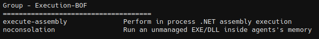

# Execution-BOF

BOFs for inline execution



## execute-assembly

Perform in process .NET assembly execution

```
execute-assembly <binary> [params]
```


The defaults are set as follows in `execute-assembly/inlineExecute-Assembly.c` to change them, edit and recompile.

```
	char* appDomain = "test";
	char* pipeName = "test";
	char* slotName = "test";
	BOOL amsi = 1;
	BOOL etw = 1;
	BOOL revertETW = 1;
	BOOL mailSlot = 0;
	ULONG entryPoint = 1;
```


## inline-ea

Inline-EA is a Beacon Object File (BOF) to execute .NET assemblies in  your current Beacon process. This tool was built to bypass the latest Elastic at the time of making,  version 8.17.4. This tool also works against CrowdStrike Falcon and  Microsoft Defender for Endpoint (MDE).

```
inline-ea <binary> [params]
```


## Credits

* InlineExecute-Assembly - https://github.com/anthemtotheego/InlineExecute-Assembly
* AMSI bypass - https://practicalsecurityanalytics.com/new-amsi-bypss-technique-modifying-clr-dll-in-memory/
* Inline-EA - https://github.com/EricEsquivel/Inline-EA