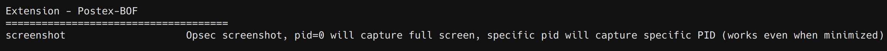
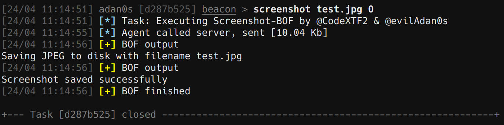

# Postex-BOF

BOFs kit for post exploitation.



## Screenshot

A screenshot capability that uses WinAPI.

* PID=0: capture full screen
* specific PID: capture specific PID (works even when minimized)

```
screenshot [save filename] [pid]
```

## Credits
* ScreenshotBOF - https://github.com/CodeXTF2/ScreenshotBOF