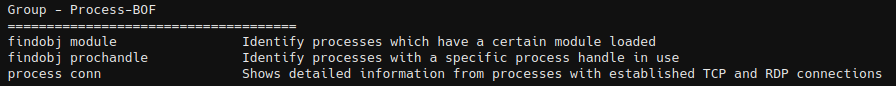
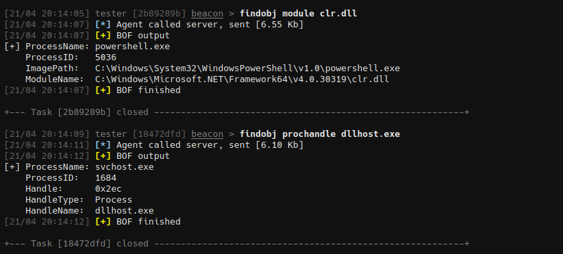

# Process-BOF

This extension increases situational awareness of processes, modules, and services by providing a set of Beacon Object File (BOF) commands.



## findobj

Enumerate processes for specific modules or process handles. Taken from [outflanknl/C2-Tool-Collection](https://github.com/outflanknl/C2-Tool-Collection/tree/main/BOF/FindObjects)

```
findobj <type> <name>
```

| Type         | Description                                                                                    |
|--------------|------------------------------------------------------------------------------------------------|
| `module`     | Enumerate processes for specific loaded modules (eg. `winhttp.dll`, `amsi.dll` or  `clr.dll`). |
| `prochandle` | Enumerate processes for specific process handles (eg. `lsass.exe`).                            |




## process

Show detailed information from processes with established TCP and RDP connections.

```
process conn
```


## procfreeze

Process freeze/unfreeze using PPL bypass technique via WerFaultSecure.exe.

```
procfreeze freeze <pid>
procfreeze unfreeze
```

Requirements:
- Elevated privileges (SYSTEM or Administrator)
- SeDebugPrivilege enabled
- Windows 10/11 with WerFaultSecure.exe

**Unfreeze may not work on Windows 10**. 

The target process may remain frozen after running `pf unfreeze`. In such cases, you will need to manually terminate the WerFaultSecure.exe process or reboot the system.


## Credits
* C2-Tool-Collection - https://github.com/outflanknl/C2-Tool-Collection
* ColdWer - https://github.com/0xsh3llf1r3/ColdWer
* EDR-Freeze - https://github.com/TwoSevenOneT/EDR-Freeze